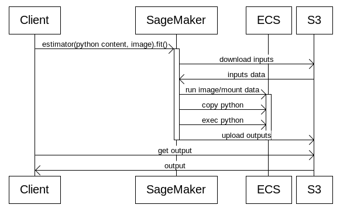

<!---
  Copyright 2019 Amazon.com, Inc. or its affiliates. All Rights Reserved.

  Licensed under the Apache License, Version 2.0 (the "License").
  You may not use this file except in compliance with the License.
  A copy of the License is located at

      http://www.apache.org/licenses/LICENSE-2.0

  or in the "license" file accompanying this file. This file is distributed
  on an "AS IS" BASIS, WITHOUT WARRANTIES OR CONDITIONS OF ANY KIND, either
  express or implied. See the License for the specific language governing
  permissions and limitations under the License.
-->
# SageMaker integration

This document provides a brief overview of SageMaker and how it is integrated with Anubis.

## Can SageMaker run arbitrary code?

Yes.

## How does SageMaker work low level?

https://docs.aws.amazon.com/sagemaker/latest/dg/your-algorithms-training-algo.html#your-algorithms-training-algo-running-container-dist-training

```
docker run image train
```

train is the predefined command to run in the container. (serve can be another one)

## What happens in ScriptMode?

Taking a look to the API - https://sagemaker.readthedocs.io/en/stable/estimators.html

User specifies **docker image**, **python script **and** dependencies**,** s3 inputs **and** s3 output.**

In a nutshell it does the following in ScriptMode:



1. Client gets the contents of the entry point file and POSTs them along with the request to the server.
2. [Image: sagemaker.png]
3. SageMaker creates a container with requested **image** 
4. The contents of the **python script**  are copied to the container
5. SageMaker does something to get **dependencies** to the container - some **pip install** ?
6. **s3 outputs** are downloaded - user provides a role to do that - after that they are mounted to the **container**.
7. The python is executed and the outputs are pushed to **s3 output**.


[Link](https://wsd.aka.amazon.com/?lz=cGFydGljaXBhbnQgQ2xpZW50IGFzIEMKAAwMU2FnZU1ha2VyIGFzIFNNAA8NRUNTIGFzIEVDUwAlDjMAJwUzCgpDIC0-IFNNOiBlc3RpbWF0b3IocHl0aG9uIGNvbnRlbnQsIGltYWdlKS5maXQoKQphY3RpdmF0ZSBTTQpTTS0-UzM6IGRvd25sb2FkIGlucHV0cwpTMy0-U006AAgHIGRhdGEAJwVFQ1M6IHJ1bgBMBi9tb3VudAAYBgBNCUVDUwAhCmNvcHkgAIEIBgA2CmV4ZWMACQxTMzogdXAAegVvdXQAewVkZQBDDQAEC1NNAIFqBzM6IGdldAArBwpTMyAtPiBDOgAICAogCgoKCg&s=default&h=m_Nq5oNyx5xYpUeJ)
That looks very similar to the way we run benchmarks.

More on how SageMaker runs containers: https://docs.aws.amazon.com/sagemaker/latest/dg/your-algorithms-training-algo.html#your-algorithms-training-algo-running-container-dist-training

## What's the requirements to run something on SageMaker?

**The container's entrypoint should just not die on train.**

So if ENTRYPOINT is **bash**, there should be **train** executable. If it's python script it should just digest the **train** arg.
https://github.com/aws/sagemaker-containers - sagemaker_containers library provides entrypoints for train/server.

## How do we run a custom bash on SageMaker?

[sagemaker-containers](https://github.com/aws/sagemaker-containers) can run py or bash entrypoints.
https://github.com/aws/sagemaker-containers/blob/master/src/sagemaker_containers/_entry_point_type.py

If it's a path with **setup.py** - execute as python package, else if it's a .py-file - run it as is. Otherwise we don't know better and it's probably just some command.

**NOTE**: But that doesn't mean, that any container using [sagemaker-containers](https://github.com/aws/sagemaker-containers) is able to do that. 
As of now 5/29/2019, dear reader from the bright future, 

TensorFlow container can run py or bash: https://github.com/icywang86rui/sagemaker-tensorflow-container/blob/merge-dockerfile/src/sagemaker_tensorflow_container/training.py#L157
MXNet container can just run py: https://github.com/laurenyu/sagemaker-mxnet-containers/blob/new-dockerfiles/src/sagemaker_mxnet_container/training.py#L77

Example: https://github.com/aws-samples/sagemaker-horovod-distributed-training/blob/master/src/horovod_launcher.py
There's a burger. 🍔 Python wrapper → bash wrapper for mpirun → mpirun → python benchmark


## What happens to watcher?

The watcher uses the SageMaker boto3 client to poll jobs for their state 
([see here](https://github.com/awslabs/benchmark-ai/blob/60d6ace7414f8b898762e4e4b88c62abd9c3ac77/watcher/src/bai_watcher/kafka_service_watcher.py#L137)).


## How do we embed client-library to the benchmark instance?

It's clearly a dependency to the python code. We just pass it to the estimator.


## How does the script discovers it's environment? (other hosts/data dirs/data/...)

### Raw image - FILES + ENV + CONVENTIONS

https://docs.aws.amazon.com/sagemaker/latest/dg/your-algorithms-training-algo.html#your-algorithms-training-algo-running-container-dist-training

An image gets a file **/opt/ml/input/config/resourceconfig.json** with the config data:

```
{
"current_host": "algo-1",
"hosts": ["algo-1","algo-2","algo-3"],
"network_interface_name":"eth1"
}
```

The data is mounted to /opt/ml/input/data/

### SageMaker image - ENV

We can use a provided library https://github.com/aws/sagemaker-containers/
This library wraps all the configuration in unified environment variables SM_HOSTS, SM_INPUT_DIR etc.

## How do we scale? How do we do horovod/parameter server?

Since it's a ECS, there's a lot of magic there compared to more straightforward k8s setup. Example: [https://github.com/aws-samples/sagemaker-horovod-distributed-training](https://github.com/aws-samples/sagemaker-horovod-distributed-training/)

1. mpirun is wrapped in python (example: https://github.com/aws-samples/sagemaker-horovod-distributed-training/blob/master/src/horovod_launcher.py
2. They do real ssh vs kubectl exec in k8s.
3. They fake gethostname system call. https://github.com/aws-samples/sagemaker-horovod-distributed-training/blob/master/docker/resources/changehostname.c
4. https://sagemaker.readthedocs.io/en/stable/sagemaker.tensorflow.html#tensorflow-estimator - we can enable MPI/Param Server in TensorFlow.
5. Number of instances is passed to estimator

The mentioned library https://github.com/aws/sagemaker-containers/ provides a lot of that out of the box.

Most of the time we can just add something like that to estimator.

```
     distributions={
         "mpi": {
             "enabled": True,
             "processes_per_host": 8,
             "custom_mpi_options": "-x SOMETHING",
         }
     },
```

## Are there images runnable on K8S, but not on SageMaker?

### The container cannot deal with train command.

Entrypoint fails to execute **train** for whatever reason. This can be actually the main issue with arbitrary container. We can run vanilla mxnet on 

### Different requirements for Horovod/Whatever distribution model

As opposed to K8S exec, ECS is limited to ssh - so mpirun does “real” ssh. We can imagine light-weighted horovod container without ssh.

## Are there images runnable on SageMaker, but not on K8S?

No. We just have more control over execution of the container.

